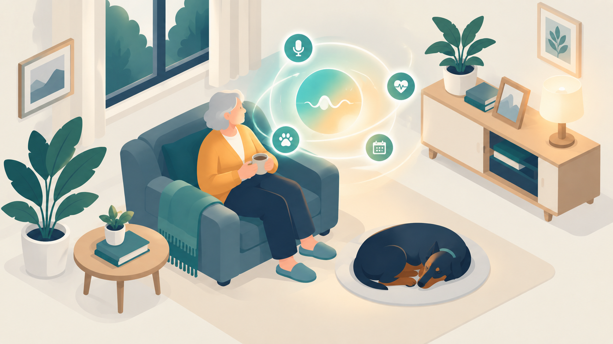

  

<h1 align="center">Serenity</h1>

<b>Asistente de IA para el cuidado del adulto mayor.</b>

> **Este repositorio es una presentación pública del producto.** Aquí
> encontrarás la visión, el alcance y el estado del proyecto.

## Qué es

Serenity es un asistente virtual con IA generativa orientado al cuidado del
adulto mayor en casa. Conversa con contexto, recuerda lo relevante de cada
persona y responde distinto según qué tan sensible es la información que
está en juego.

El objetivo no es reemplazar el cuidado humano — es sostener continuidad
cuando nadie de la familia puede estar presente en ese momento: acompañar,
recordar, y saber cuándo escalar a una persona real.

## Qué incluye

- **Memoria semántica y contexto conversacional** — el asistente recuerda
  a la persona, no solo el turno de conversación actual.
- **Enrutamiento por nivel de privacidad** — no toda consulta se trata
  igual; el sistema decide qué tan sensible es un dato antes de responder.
- **Respuesta automática de emergencias** — integración de voz en tiempo
  real (Gemini Live) con llamadas telefónicas (Twilio) para escalar cuando
  hace falta.
- **Integraciones IoT** — sensores, cámaras IP y visión por computador
  conectados al asistente para automatizaciones contextuales en el hogar.

## Estado

**En desarrollo activo.**

## Sobre el proyecto

Construido por **Luis Restrepo** — bioingeniero y desarrollador full-stack
especializado en IA aplicada a salud.

Relacionado: [Vera](https://github.com/LuisRG12/vera_voice_agent) — el
agente de voz para seguimiento clínico postoperatorio que nació de este
mismo trabajo, con repo público y licencia MIT.

[LinkedIn](https://www.linkedin.com/in/luiscarlosrestrepogallego317) ·
[clrestrepo8@gmail.com](mailto:clrestrepo8@gmail.com)
